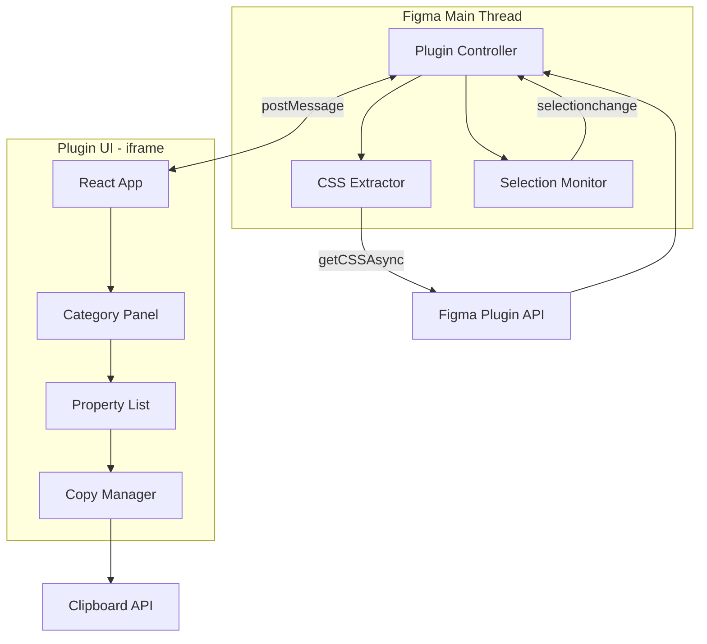
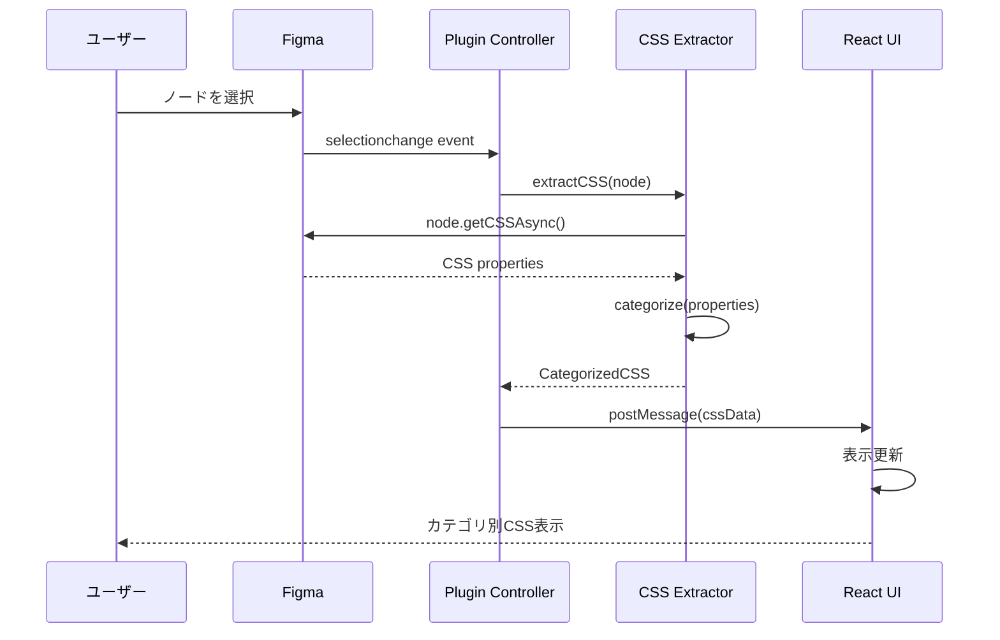
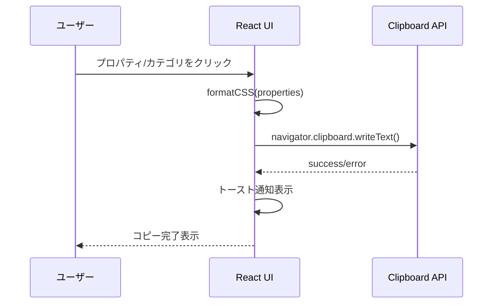
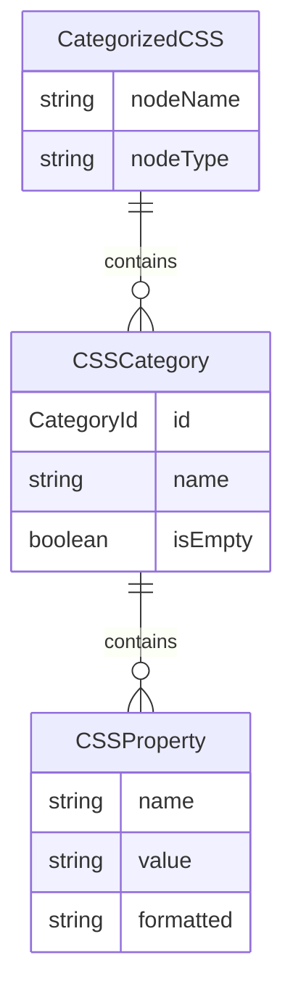

# Design Document: Figma CSS Inspector

## Overview

**Purpose**: このプラグインは、Figmaで選択したノードからCSSプロパティを抽出し、開発用途別に分類して表示・コピーする機能を提供する。

**Users**: フロントエンド開発者およびデザイナーが、デザインからコードへの変換ワークフローで利用する。

**Impact**: Figma標準のInspectパネルを拡張し、カテゴリ別表示とワンクリックコピー機能で開発効率を向上させる。

### Goals
- 選択ノードからCSSプロパティを自動抽出
- 開発用途別（レイアウト、スペーシング、タイポグラフィ、カラー、ボーダー、エフェクト）に分類表示
- 個別・カテゴリ・全体でのコピー機能
- 500ms以内の応答性能

### Non-Goals
- CSS変数やデザイントークンへの変換（将来検討）
- 複数ノード同時選択時の差分比較
- CSSプリプロセッサ（SCSS/Less）出力
- コード生成プラグイン（Codegen）としての動作

## Architecture

### Architecture Pattern & Boundary Map



**Architecture Integration**:
- **Selected pattern**: 2-Layer Architecture（Main Thread + UI iframe）- Figma標準パターン
- **Domain boundaries**: Main Thread（Figma API操作）、UI（表示・インタラクション）で責務分離
- **Existing patterns preserved**: Figma Plugin標準のpostMessage通信
- **New components rationale**: CSSExtractor（抽出ロジック分離）、CategoryPanel（カテゴリ表示責務）
- **Steering compliance**: 該当なし（ステアリング未設定）

### Technology Stack

| Layer | Choice / Version | Role in Feature | Notes |
|-------|------------------|-----------------|-------|
| Runtime | Figma Plugin API | ノード操作・CSS抽出 | getCSSAsync使用 |
| Language | TypeScript 5.x | 型安全なコード | @figma/plugin-typings |
| UI Framework | React 18.x | コンポーネントベースUI | 状態管理含む |
| Build Tool | esbuild | 高速ビルド | code.ts, ui.tsx両方 |
| Styling | CSS Modules | スコープ付きスタイル | Figmaテーマ対応 |

## System Flows

### CSS抽出・表示フロー



### コピーフロー



## Requirements Traceability

| Requirement | Summary | Components | Interfaces | Flows |
|-------------|---------|------------|------------|-------|
| 1.1 | ノード選択時CSS自動抽出 | SelectionMonitor, CSSExtractor | IMessage, ICategorizedCSS | CSS抽出フロー |
| 1.2 | 複数選択時は最初のノード | SelectionMonitor | - | CSS抽出フロー |
| 1.3 | 未選択時ガイダンス表示 | App, EmptyState | IMessage | - |
| 1.4 | 選択変更時の表示更新 | SelectionMonitor | IMessage | CSS抽出フロー |
| 2.1 | 6カテゴリ分類表示 | CSSExtractor, CategoryPanel | ICSSCategory | - |
| 2.2 | カテゴリ折りたたみ | CategoryPanel | ICategoryState | - |
| 2.3 | 空カテゴリの非表示 | CategoryPanel | ICSSCategory | - |
| 2.4 | 論理的順序での表示 | CSSExtractor | ICSSCategory | - |
| 3.1 | 個別プロパティコピー | PropertyItem, CopyManager | ICSSProperty | コピーフロー |
| 3.2 | カテゴリ一括コピー | CategoryPanel, CopyManager | ICSSCategory | コピーフロー |
| 3.3 | 全体コピー | App, CopyManager | ICategorizedCSS | コピーフロー |
| 3.4 | コピー完了フィードバック | Toast | IToastMessage | コピーフロー |
| 4.1 | 標準CSS構文出力 | CSSExtractor | ICSSProperty | - |
| 4.2 | HEX/RGBA色出力 | CSSExtractor | - | - |
| 4.3 | px単位サイズ出力 | CSSExtractor | - | - |
| 4.4 | Auto Layout→flexbox | CSSExtractor | - | - |
| 4.5 | テキストスタイル出力 | CSSExtractor | - | - |
| 5.1 | Figma調和UI | App, CategoryPanel | - | - |
| 5.2 | リサイズ可能ウィンドウ | figma.showUI options | - | - |
| 5.3 | プロパティ名/値の視覚区別 | PropertyItem | - | - |
| 5.4 | モノスペースフォント | CSS styling | - | - |
| 5.5 | 幅狭時の折り返し | CSS styling | - | - |
| 6.1 | 500ms以内応答 | CSSExtractor | - | CSS抽出フロー |
| 6.2 | パフォーマンス影響なし | 全体設計 | - | - |
| 6.3 | エラーハンドリング | ErrorBoundary, App | IErrorMessage | - |

## Components and Interfaces

| Component | Domain/Layer | Intent | Req Coverage | Key Dependencies | Contracts |
|-----------|--------------|--------|--------------|------------------|-----------|
| PluginController | Main Thread | プラグインエントリポイント、メッセージルーティング | 1.1-1.4, 6.3 | Figma API (P0), CSSExtractor (P0) | Service |
| SelectionMonitor | Main Thread | 選択変更の監視と通知 | 1.1, 1.2, 1.4 | Figma API (P0) | Service |
| CSSExtractor | Main Thread | CSS抽出とカテゴリ分類 | 2.1, 2.4, 4.1-4.5, 6.1 | Figma API (P0) | Service |
| App | UI | UIルートコンポーネント | 1.3, 3.3, 5.1, 6.3 | CategoryPanel (P0) | State |
| CategoryPanel | UI | カテゴリ表示と折りたたみ | 2.1-2.3, 3.2 | PropertyList (P1) | State |
| PropertyList | UI | プロパティ一覧表示 | 5.3-5.5 | PropertyItem (P1) | - |
| PropertyItem | UI | 個別プロパティ表示とコピー | 3.1, 5.3-5.4 | CopyManager (P1) | - |
| CopyManager | UI | クリップボード操作 | 3.1-3.4 | Clipboard API (P0) | Service |
| Toast | UI | 通知表示 | 3.4 | - | - |

### Main Thread Layer

#### PluginController

| Field | Detail |
|-------|--------|
| Intent | プラグインのライフサイクル管理とUI通信 |
| Requirements | 1.1, 1.2, 1.3, 1.4, 6.3 |

**Responsibilities & Constraints**
- プラグイン起動時のUI表示（figma.showUI）
- SelectionMonitorからの選択変更イベント処理
- UI←→Main Thread間のメッセージルーティング
- エラーハンドリングとUIへのエラー通知

**Dependencies**
- Inbound: Figma Plugin Runtime — プラグイン起動 (P0)
- Outbound: SelectionMonitor — 選択監視開始 (P0)
- Outbound: CSSExtractor — CSS抽出依頼 (P0)
- Outbound: figma.ui — UIへのメッセージ送信 (P0)

**Contracts**: Service [x] / State [ ]

##### Service Interface
```typescript
interface IPluginController {
  initialize(): void;
  handleSelectionChange(nodes: readonly SceneNode[]): Promise<void>;
  sendToUI(message: PluginToUIMessage): void;
  handleUIMessage(message: UIToPluginMessage): void;
}
```
- Preconditions: Figma Plugin APIが利用可能
- Postconditions: UIが表示され、選択監視が開始される
- Invariants: 常に1つのUIインスタンスのみ存在

#### SelectionMonitor

| Field | Detail |
|-------|--------|
| Intent | Figma選択変更イベントの監視と通知 |
| Requirements | 1.1, 1.2, 1.4 |

**Responsibilities & Constraints**
- `figma.on("selectionchange")` イベントリスナー管理
- 複数選択時は最初のノードのみを通知
- 選択解除時は空配列を通知

**Dependencies**
- Inbound: PluginController — 監視開始/停止 (P0)
- External: Figma API — selectionchange event (P0)

**Contracts**: Service [x]

##### Service Interface
```typescript
interface ISelectionMonitor {
  startMonitoring(callback: SelectionCallback): void;
  stopMonitoring(): void;
  getCurrentSelection(): SceneNode | null;
}

type SelectionCallback = (node: SceneNode | null) => void;
```

#### CSSExtractor

| Field | Detail |
|-------|--------|
| Intent | ノードからCSSを抽出し6カテゴリに分類 |
| Requirements | 2.1, 2.4, 4.1, 4.2, 4.3, 4.4, 4.5, 6.1 |

**Responsibilities & Constraints**
- `node.getCSSAsync()` によるCSS取得
- プロパティの6カテゴリ分類（レイアウト、スペーシング、タイポグラフィ、カラー、ボーダー、エフェクト）
- 各カテゴリ内での論理的順序ソート
- 500ms以内の処理完了

**Dependencies**
- Inbound: PluginController — 抽出依頼 (P0)
- External: Figma API — getCSSAsync (P0)

**Contracts**: Service [x]

##### Service Interface
```typescript
interface ICSSExtractor {
  extractAndCategorize(node: SceneNode): Promise<ICategorizedCSS>;
}

interface ICategorizedCSS {
  nodeName: string;
  nodeType: string;
  categories: ICSSCategory[];
}

interface ICSSCategory {
  id: CategoryId;
  name: string;
  properties: ICSSProperty[];
  isEmpty: boolean;
}

interface ICSSProperty {
  name: string;      // e.g., "font-size"
  value: string;     // e.g., "16px"
  formatted: string; // e.g., "font-size: 16px;"
}

type CategoryId =
  | 'layout'
  | 'spacing'
  | 'typography'
  | 'color'
  | 'border'
  | 'effect';

const CATEGORY_PROPERTY_MAP: Record<CategoryId, string[]> = {
  layout: ['width', 'height', 'display', 'flex-direction', 'align-items', 'justify-content', 'flex-wrap', 'position', 'top', 'left', 'right', 'bottom'],
  spacing: ['margin', 'margin-top', 'margin-right', 'margin-bottom', 'margin-left', 'padding', 'padding-top', 'padding-right', 'padding-bottom', 'padding-left', 'gap'],
  typography: ['font-family', 'font-size', 'font-weight', 'line-height', 'letter-spacing', 'text-align', 'text-decoration', 'text-transform', 'color'],
  color: ['background', 'background-color', 'opacity'],
  border: ['border', 'border-width', 'border-style', 'border-color', 'border-radius', 'border-top-left-radius', 'border-top-right-radius', 'border-bottom-left-radius', 'border-bottom-right-radius'],
  effect: ['box-shadow', 'filter', 'backdrop-filter', 'mix-blend-mode']
};
```
- Preconditions: nodeが有効なSceneNode
- Postconditions: カテゴリ分類されたCSSオブジェクトを返却
- Invariants: 空カテゴリもisEmpty=trueで返却（UI側でフィルタ）

**Implementation Notes**
- getCSSAsyncがサポートされないノードタイプ（GroupNode等）はエラーハンドリング
- colorカテゴリのcolorプロパティはtypographyにも関連するが、テキスト文脈ではtypographyに分類

### UI Layer

#### App

| Field | Detail |
|-------|--------|
| Intent | UIルートコンポーネント、状態管理 |
| Requirements | 1.3, 3.3, 5.1, 6.3 |

**Responsibilities & Constraints**
- Main Threadからのメッセージ受信と状態更新
- 未選択時のEmptyState表示
- 全体コピーボタンの提供
- エラー状態の表示

**Dependencies**
- Inbound: Main Thread — postMessage (P0)
- Outbound: CategoryPanel — CSSデータ渡し (P0)
- Outbound: CopyManager — 全体コピー (P1)

**Contracts**: State [x]

##### State Management
```typescript
interface IAppState {
  cssData: ICategorizedCSS | null;
  isLoading: boolean;
  error: IErrorMessage | null;
}

interface IErrorMessage {
  code: string;
  message: string;
}
```

#### CategoryPanel

| Field | Detail |
|-------|--------|
| Intent | カテゴリ表示、折りたたみ、カテゴリコピー |
| Requirements | 2.1, 2.2, 2.3, 3.2 |

**Responsibilities & Constraints**
- カテゴリヘッダーの表示と折りたたみトグル
- 空カテゴリの非表示処理
- カテゴリ単位でのコピーボタン

**Dependencies**
- Inbound: App — ICSSCategory (P0)
- Outbound: PropertyList — properties (P1)
- Outbound: CopyManager — カテゴリコピー (P1)

**Contracts**: State [x]

##### State Management
```typescript
interface ICategoryPanelProps {
  category: ICSSCategory;
  onCopy: (properties: ICSSProperty[]) => void;
}

interface ICategoryState {
  isExpanded: boolean;
}
```

#### CopyManager

| Field | Detail |
|-------|--------|
| Intent | クリップボード操作とフィードバック通知 |
| Requirements | 3.1, 3.2, 3.3, 3.4 |

**Responsibilities & Constraints**
- Clipboard APIを使用したテキストコピー
- コピー成功/失敗のトースト通知トリガー
- CSSフォーマット（改行区切り）

**Dependencies**
- External: Clipboard API — navigator.clipboard.writeText (P0)
- Outbound: Toast — 通知表示 (P1)

**Contracts**: Service [x]

##### Service Interface
```typescript
interface ICopyManager {
  copyText(text: string): Promise<boolean>;
  copyProperties(properties: ICSSProperty[]): Promise<boolean>;
  copyAllCategories(categories: ICSSCategory[]): Promise<boolean>;
}
```

#### PropertyItem / PropertyList / Toast

これらはプレゼンテーショナルコンポーネントで、新しい境界を導入しない。

**Implementation Notes**:
- PropertyItem: プロパティ名（グレー）と値（黒）を視覚的に区別、ホバーでコピーアイコン表示
- PropertyList: PropertyItemの配列レンダリング
- Toast: 2秒後に自動消去、右下に表示

## Data Models

### Domain Model



**Aggregates**:
- CategorizedCSS: 集約ルート、1つのノードから抽出されたCSS全体
- CSSCategory: 6つの固定カテゴリ
- CSSProperty: 個別のCSSプロパティ

**Invariants**:
- CSSPropertyのformattedは常に `${name}: ${value};` 形式
- CategoryIdは固定の6種類のみ

### Message Contracts

```typescript
// Plugin → UI
type PluginToUIMessage =
  | { type: 'CSS_DATA'; payload: ICategorizedCSS }
  | { type: 'NO_SELECTION'; payload: null }
  | { type: 'ERROR'; payload: IErrorMessage }
  | { type: 'LOADING'; payload: boolean };

// UI → Plugin
type UIToPluginMessage =
  | { type: 'REQUEST_CSS'; payload: null }
  | { type: 'CLOSE'; payload: null };
```

## Error Handling

### Error Strategy
- **Fail Fast**: getCSSAsync失敗時は即座にエラーメッセージ表示
- **Graceful Degradation**: 部分的なCSS取得成功時は取得できたプロパティのみ表示

### Error Categories and Responses

**User Errors**:
- 未選択状態 → EmptyStateコンポーネントでガイダンス表示

**System Errors**:
- getCSSAsync失敗 → 「CSSを取得できませんでした」エラー表示
- クリップボードアクセス失敗 → トーストで「コピーに失敗しました」表示

**Business Logic Errors**:
- 非対応ノードタイプ → 「このノードタイプはCSS抽出に対応していません」表示

### Monitoring
- console.errorでのエラーログ出力
- UIでのエラー状態表示

## Testing Strategy

### Unit Tests
- CSSExtractor.extractAndCategorize: 各カテゴリへの正しい分類
- CSSExtractor.categorize: プロパティ分類ロジック
- CopyManager.copyText: フォーマット出力の検証
- Message type guards: 型安全性の検証

### Integration Tests
- Main Thread ↔ UI メッセージング
- 選択変更 → CSS表示の一連フロー
- コピー → トースト表示フロー

### E2E/UI Tests
- ノード選択 → カテゴリ表示
- カテゴリ折りたたみ/展開
- 各レベルでのコピー操作
- エラー状態の表示

## Optional Sections

### Performance & Scalability

**Target Metrics**:
- CSS抽出・表示: 500ms以内（要件6.1）
- UI操作（折りたたみ、コピー）: 100ms以内

**Optimization Techniques**:
- getCSSAsyncは非同期処理でUIブロッキング回避
- React.memoによる不要な再レンダリング防止
- カテゴリ状態はローカル管理（Context不使用）

### Security Considerations

- クリップボードへの書き込みのみ（読み取りなし）
- 外部通信なし（全てローカル処理）
- ユーザーデータの永続化なし
